# GNNs and Generative Models for Drug Discovery

These brief 
notes were made by Logan Mondal Bhamidipaty as part of a tutorial completed at Oxford (Michaelmas 2023) under Martin Buttenschoen.

  <a>
    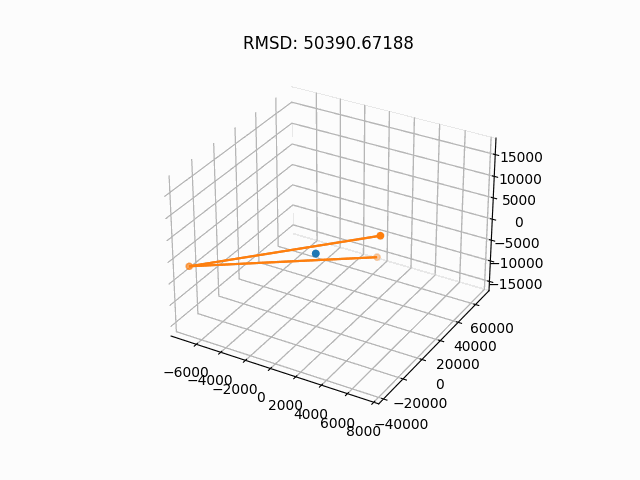
  </a>
   

_Reverse diffusion of my [simple EDM](simple_edm.ipynb) purposely overfit on a water molecule._

# Graph Neural Networks (GNNs)

## Basics

**Definition:** _A GNN is an optimizable transformation on all attributes of the graph (nodes, edges, global-context) that preserves graph symmetries (permutation invariances)._

**Tasks:** In general, there are 3 kinds of tasks that GNN perform: node-level (e.g., predicting relations in social media networks), edge-level (image scene understanding), and graph-level (molecule property prediction). 

**Representation of Graphs:** GNNs often have to handle large data (e.g., social media network), so it's important to have efficient representations. Adjacency matrices are often large and sparse, so adjacency lists are frequently preferred. Another bonus of adjacency lists is that they are _permutation invariant_.

As will be briefly touched on later, GNNs can be viewed as a generalization of many types of neural networks including transformers and CNNs.

## Message-Passing

Message passing allows graphs to build latent representations of graph features that incorporate connectivity information (e.g., neighbors).

**Simple Generalization:** Simple message passing involves three steps:
1. Aggregating information from "nearby" nodes
2. Pooling this information (e.g., using sums, averages, or attention)
3. Passing pooled information through an update function (often a neural network)

In this way, a latent representation of a graph is built up over time that gradually incorporates the connectivity information of a graph. 

**Graph Convolutions, Laplacians, and Virtual Augments**: One common way of aggregating information is with _graph convolutions_ that harness the many interesting properties of [graph Laplacians](https://en.wikipedia.org/wiki/Laplacian_matrix). In special cases where graphs are sparsely connected or have orphan nodes, researchers might artificially add a "virtual node" or "virtual edge" that connects all of targeted objects. 

## "Flavors" of GNN Layers

_Reference: [[2104.13478] Geometric Deep Learning: Grids, Groups, Graphs, Geodesics, and Gauges](https://arxiv.org/abs/2104.13478), Sec: 5.3 Graph Neural Networks_

Following the reference above, we can divide GNN layers into three distinct flavors: (1) convolutional, (2) attentional, and (3) message-passing. Where each subsequent category is a generalization of the previous so that $\text{convolution } \subseteq \text{ attention } \subseteq \text{ message-passing}$. More formal definitions can be found in the Bronstein textbook linked; however, a quick formal delineation is provided below. 

**Convolutional:**

  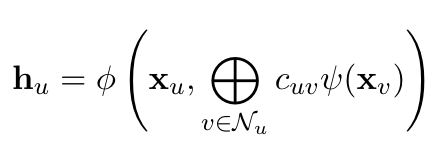

**Attentional:**

  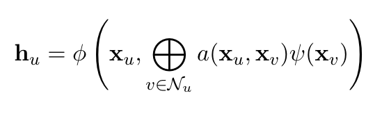

**Message-Passing:**

  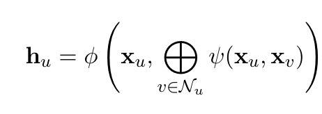

# Diffusion Models

## Introduction

**Motivation:** Let's say we want to generate an image of a cat. Images of a cat are often tensor of RGB values, in other words, they are a matrix in $\mathbb{R}^{m \times n \times 3}$. In fact, all images of cats can be (if transformed properly) considered some $\mathbb{R}^{m \times n \times 3}$ tensor--every _possible_ image of a cat is one such tensor. In a sense, there is some unknown, extremely-complicated, high-dimensional distribution of cat images. If we were to be able to somehow model this distribution, we could then sample from it to generate novel images of cats.

**Overview:** The idea of a diffusion model is that we can gradually deform a complicated distribution (e.g., the true distribution of cat images) by adding noise until the final distribution is a simpler multivariate Gaussian. If we add our noise in a very specific way (discussed briefly below), we can then use the math of stochastic differential (or difference) equations to sample from the original complicated distribution. Thus, we will have a way from turning easy-to-generate Gaussian noise into samples from a complicated unknown distribution using only known samples (e.g., images of cats) from that original distribution.

  <a href="https://towardsdatascience.com/understanding-diffusion-probabilistic-models-dpms-1940329d6048">
    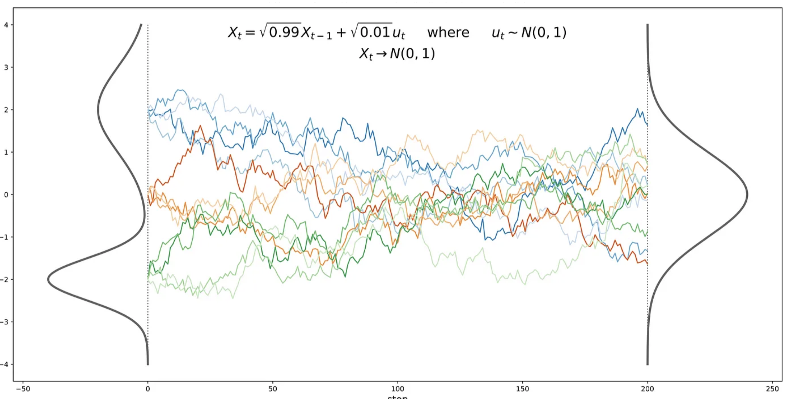
  </a>

_Image Source: [Understanding Diffusion Probabilistic Models (DPMs)](https://towardsdatascience.com/understanding-diffusion-probabilistic-models-dpms-1940329d6048)_

## Forward Diffusion

The process of gradually and structurally deforming the original distribution is called "forward diffusion". An example of the forward process is explored [here](image_diffusion_exploration/forward_diffusion.ipynb).

  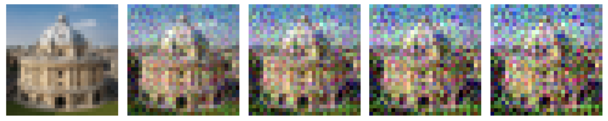

In the special case, where we only take a single noising step we have a variational autoencoder (VAE) rather than a diffusion model.

  <a href="https://arxiv.org/pdf/2208.11970.pdf">
    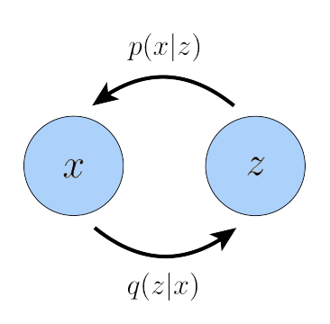
  </a>

_Image Source: [[2208.11970] Understanding Diffusion Models: A Unified Perspective](https://arxiv.org/pdf/2208.11970.pdf)_

In particular, the frequently used forward process is described as an isotropic Gaussian with a variance-preserving schedule with a mean near the previous random variable. Formally, we can derive $p$ and $q$ using [ELBO optimization](https://en.wikipedia.org/wiki/Evidence_lower_bound) so that:

  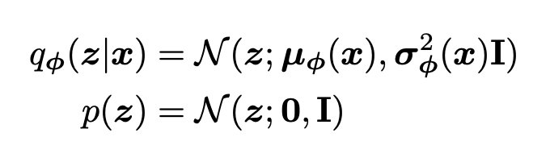

### Reparameterization Trick

Had the literature stuck to this naive formulation, we wouldn't have been able to deploy the might of gradient descent and neural networks. The sticker is that the latents $z$ are **sampled** stochastically, so gradients cannot propagate. Luckily, we can use a simple "reparameterization trick" to express this random variable as a deterministic function of $x$:

$$ x = \mu + \sigma \odot \epsilon $$

where $\epsilon$ is noise from the multivariate standard normal. In Luo's words, "arbitrary Guassian distributions can be interpreted as standard Gaussians (of which $\epsilon$ is a sample) that have their mean shifted from zero to the target mean $\mu$ by addition, and their variance stretched by the target variance $\sigma^2$."

The trick also vastly simplifies the math of forward diffusion and (as we will discuss) enables the neural network to be reduced to a simple noise prediction machine. 

## Reverse Process

The reverse process is the process of gradually denoising a Gaussian variate to sample from the complex original distribution. Since the forward process is an extremely precise noising procedure, the reverse process is actually fairly simple.

  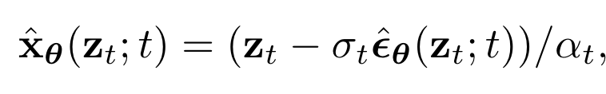

The mathematical details can be followed in [[2107.00630] Variational Diffusion Models](https://arxiv.org/abs/2107.00630). Following Kingma, we can interpret this procedure in three ways:

  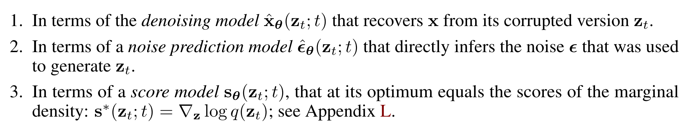

Again, the details will be relegated to the actual paper itself. Of interest, however, is the score function ($\nabla \log p(x)$) which is well-discussed in the Luo paper linked in the previous section on forward diffusion. 

# Equivariant Diffusion Models

_Reference: [[2203.17003] Equivariant Diffusion for Molecule Generation in 3D](https://arxiv.org/abs/2203.17003)_

This section is brief because EDMs are explored in much greater depth [here](simple_edm.ipynb). This section is merely here to provide greater reference to the original paper and to showcase the water diffusion.

## Equivariance

  

_Image Source: [[2102.09844] E(n) Equivariant Graph Neural Networks](https://arxiv.org/abs/2102.09844)_

## Optimization

  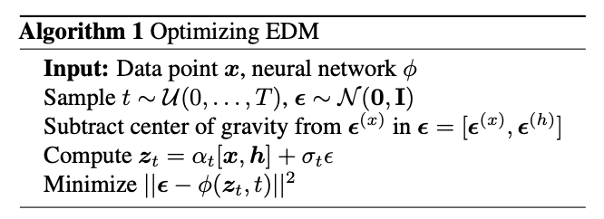

## Sampling

  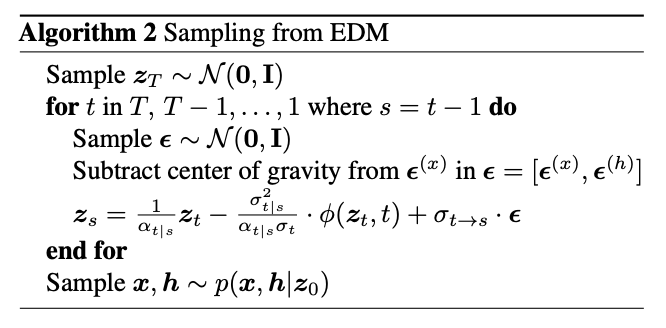

Using our simple EDM, we can visualize the diffusion process on a molecule of water (see top of page).

